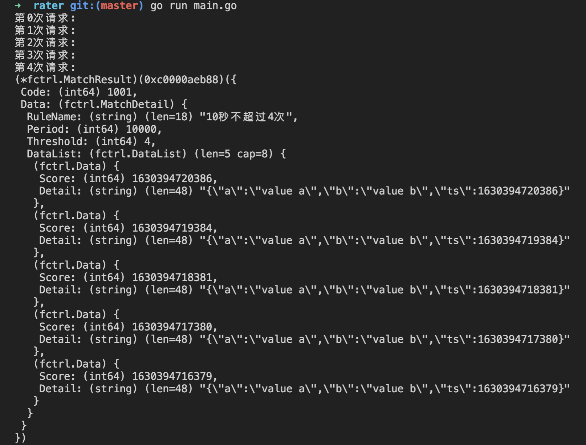

# 频率控制
>提到限流，一般大家会想到漏桶或令牌桶算法，网上介绍的文章也很多，但是可能没有人告诉你这两种算法的实现都不是分布式的，仅仅是应用于单机的。而且漏桶和令牌桶都不具备向用户的解释性。

于是我们引申频率控制限流的概念，简单的说频率控制是指在滑动窗口周期内的事件不超过一定数量。

那么频率控制具备如下特性
* 滑动窗口

    就像游标卡尺一样，有star_time及end_time的概念。
    当前时间是一分一秒在往前推移的，如果要做相对准确的频率控制，就要跟随当前时间做跟进，由此形成的时间窗口就类似于滑动一样。
* 多策略
  
    多策略是相对于单策略而言的，单策略比如当前就一个策略比如只允许一分钟5次。漏桶、令牌桶都是单策略的。
    而多策略则允许一分钟5次及十分钟10次，但凡命中两种规则中的一种那么就会触发频控。
* 可解释性
  
    漏桶令牌桶比较难向用户解释。
	
	令牌桶是按照一定的速率产生令牌，拿到令牌的请求可以进入系统。当请求被阻止的时候，如果用户深究起来，询问令牌产生的速度是不太好解释的。

	另外，漏桶令牌桶一般是网关层面，并且网关也是分布式的架构。有的厂商如果没有做好一致性哈希，就会出现用户的请求落在网关的A实例上被限流，而几乎同一时间点的请求落在网关的B实例上却被通过，这种情况更难向用户解释。
* 支持单机

    关于单机的支持，本模块实现层面大部分依赖godis，goids是纯go开发的单机版的redis。
* 支持分布式

    关于分布式的支持，本模块实现依赖于redis及redisCluster。

描述了特性，再稍微说一下不支持什么。
* 自然周期
  
  有一些业务是按照自然时间周期进行的，比如两家公司的结算周期是一个月10次，而一个月是指每个月的1号00:00:00点，即只要过了1号的凌晨就马上有新的10次转账指标。而这种时间周期明显不是滑动窗口，是自然时间周期，像这种时间周期的限流需求当前SDK并不支持，你可以基于redis来快速实现。

# 使用

## 一、安装
```golang
go get -x github.com/tigbox/fctrl
```

## 二、使用概览
1、初始化limiter
```golang

// 比如下面的是你的业务资源规则
func mockResourceConfig() *fctrl.ResourceConfig {
	rule1 := fctrl.Rule{
		Name:      "10秒不超过4次",
		Period:    "10s",
		Threshold: 4,
		Code:      1001,
		Fields:    []string{"uid", "ip"},
	}
	rule2 := fctrl.Rule{
		Name:      "1分钟不超过10次",
		Period:    "1min",
		Threshold: 10,
		Code:      1002,
		Fields:    []string{"uid", "ip"},
	}
	return &fctrl.ResourceConfig{
		Resource:      "测试的业务资源x",
		Rules:        []fctrl.Rule{rule1, rule2},
		RecordFields: []string{"a", "b"},
	}
}

// global 变量
var globalLimiter fctrl.ILimiter
var onceInitLimiter sync.Once

// 初始化限流器
func initLimiter() {
	onceInitLimiter.Do(func() {
		resourceConfig := mockResourceConfig()
		var err error
		globalLimiter, err = fctrl.LoadConfig(resourceConfig)
		if err != nil {
			panic(err)
		}
	})
}
```

2、构造你当次的entry数据
```golang
// 把你要和限流器交互的数据都封装到一个map对象中
func generateInput() map[string]interface{} {
	input := make(map[string]interface{})
	input["uid"] = 123
	input["ip"] = "127.0.0.1"
	input["a"] = "value a"
	input["b"] = "value b"
	return input
}
// 构造entry数据，这里用functional option的办法提供了Mode这个参数 
// Mode -2/-1/0/1 分别表示 仅读取不返回明细/仅读取返回明细/写入返回明细/写入不返回明细 默认是0
entry := fctrl.NewEntry(generateInput())

```

3、进行FrequencyControl的调用
```golang
// 是否命中限流频控
matchResult, err := globalLimiter.FrequencyControl(context.Background(), entry)
if err != nil {
	// 你的错误处理
	panic(err)
}
if matchResult != nil && matchResult.Code != 0 {
	// 细分场景
	switch matchResult.Code {
	case 1001:
		// 命中rule1时候的逻辑
		// your logic
	case 1002:
		//命中rule2时候的逻辑
		// your logic
	}
}
```

4、结果样例


**更多Demo见**https://gitlab.lanhuapp.com/chenzhenyu/tempman/blob/master/rater/main.go


## 配置
```golang
type ResourceConfig struct {
	Resource      string   `toml:"resource" yaml:"resource" json:"resource"`
	Rules        []Rule   `toml:"rules" yaml:"rules" json:"rules"`
	RecordFields []string `toml:"record_fields" yaml:"record_fields" json:"record_fields"`
}

type Rule struct {
	Name      string   `toml:"name" yaml:"name" json:"name"`
	Period    string   `toml:"period" yaml:"period" json:"period"`
	Threshold uint64   `toml:"threshold" yaml:"threshold" json:"threshold"`
	Code      int64    `toml:"code" yaml:"code" json:"code"`
	Fields    []string `toml:"fields" yaml:"fields" json:"fields"`
}

```
## 匹配结果
```golang
type MatchDetail struct {
	RuleName  string
	Period    int64
	Threshold int64
	DataList  DataList
}

// 频率控制返回结果
type MatchResult struct {
	Code int64
	Data interface{}
}
```

# Benchmark
```
➜  fctrl git:(develop) ✗ go test -bench=. -run=none
goos: darwin
goarch: amd64
pkg: github.com/tigbox/fctrl
cpu: Intel(R) Core(TM) i7-8750H CPU @ 2.20GHz
BenchmarkGodisWriteWithDetial-12                    6900            443944 ns/op
BenchmarkGodisWriteWithoutDetial-12                14802            114990 ns/op
BenchmarkGodisOnlyReadWithDetial-12                65042             17823 ns/op
BenchmarkGodisOnlyReadWithoutDetial-12            425139              2857 ns/op
PASS
ok      github.com/tigbox/fctrl        9.830s


➜  fctrl git:(develop) ✗ go test -bench=. -run=none
goos: darwin
goarch: amd64
pkg: github.com/tigbox/fctrl
cpu: Intel(R) Core(TM) i7-8750H CPU @ 2.20GHz
BenchmarkRedisWriteWithDetail-12             720           1732704 ns/op
BenchmarkRedisWriteWithoutDetail-12          669           1787933 ns/op
BenchmarkRedisReadWithDetail-12             1576            798690 ns/op
BenchmarkRedisReadWithoutDetail-12          1437            797730 ns/op
PASS
ok      github.com/tigbox/fctrl        5.598s

注意后面的redis是本机的，可能不具备代表意义，但是每个操作需要1.*毫秒还是符合经验值的。
既然是本机的，就再开一个redis-benchmark跑zadd试试，结果证明还是和刚才的很相近的。
redis-benchmark -h 127.0.0.1 -p 6379 -t zadd -n 10000 -q
ZADD: 20876.83 requests per second, p50=2.087 msec
```
